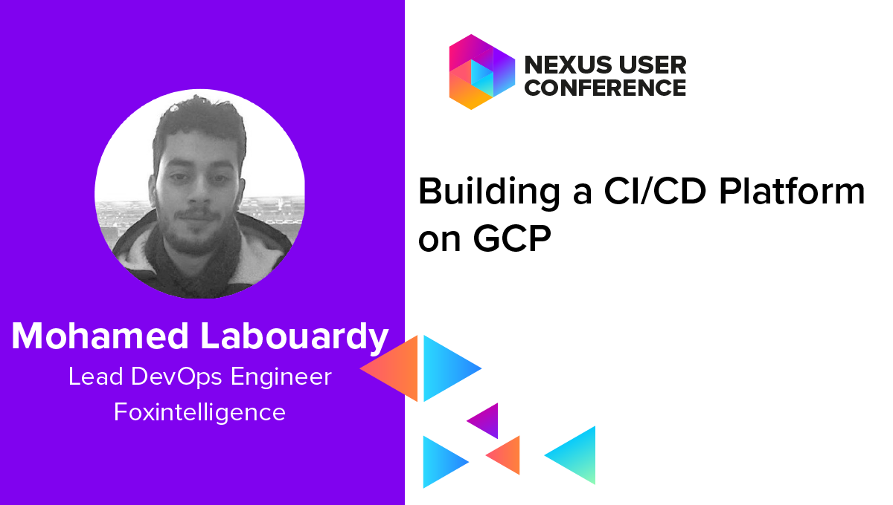

## Building a CI/CD Platform with K8S on GCP

<p align="center">
    
</p>

## Configure Nexus credentials

```
kubectl create secret generic nexus --from-file=.dockerconfigjson=/home/mohamed_labouardy/.docker/config.json --type=kubernetes.io/dockerconfigjson
```

## Create Deployment

```
kubectl apply -f deployment.yml
```

## Create Service

```
kubectl apply -f service.yml
```

## Continuous Deployment

```
- id: 'configure kubectl'
  name: 'gcr.io/cloud-builders/gcloud'
  env:
    - 'CLOUDSDK_COMPUTE_ZONE=${_CLOUDSDK_COMPUTE_ZONE}'
    - 'CLOUDSDK_CONTAINER_CLUSTER=${_CLOUDSDK_CONTAINER_CLUSTER}'
    - 'KUBECONFIG=/kube/config'
  entrypoint: 'sh'
  args:
    - '-c'
    - |
      gcloud container clusters get-credentials "$${CLOUDSDK_CONTAINER_CLUSTER}" --zone "$${CLOUDSDK_COMPUTE_ZONE}"
  volumes:
    - name: 'kube'
      path: /kube

- id: 'deploy to k8s'
  name: 'gcr.io/cloud-builders/gcloud'
  env:
    - 'KUBECONFIG=/kube/config'
  entrypoint: 'sh'
  args:
    - '-c'
    - |
      kubectl apply --recursive -f deployment
  volumes:
    - name: 'kube'
      path: /kube
```